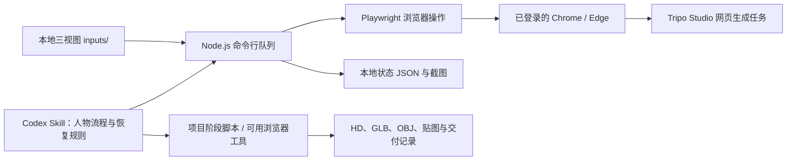

# Tripo Studio Pipeline

用 **Playwright 自动操作 Tripo Studio 网页**，把一组组正面、左侧、背面图片提交给 Tripo，按顺序执行模型生成、重拓扑和纹理生成，并保存本地断点与操作截图。

仓库同时提供一个 **Codex Skill**：让 agent 按人物生产流程组织原片参考、独立高清头部和同服装 A-Pose 全身，续接已接受的任务，检查 GLB/OBJ 交付并维护进度。下面先介绍仓库实际包含什么，再给出从安装到首次运行的步骤。

它使用已登录账号的 **Tripo Studio 积分**。无需配置 Tripo API Key；脚本通过浏览器上传图片、选择参数和点击按钮，不调用或复刻 Tripo 私有接口。

- [仓库组成与自动化范围](#overview)
- [Windows 完整安装与使用指南](references/windows.md)
- [安装依赖](#install)
- [设置配置文件](#config)
- [连接浏览器并登录 Tripo](#browser)
- [准备图片并完成首次运行](#first-run)
- [全部命令与参数](#commands)
- [在 Codex 中运行人物流程](#character)
- [模型交付、状态与日志](#outputs)
- [中断后如何恢复](#recovery)
- [常见问题](#faq)

<a id="overview"></a>

## 仓库包含什么，自动化如何工作



脚本在本机运行，3D 生成在 Tripo 服务端完成。浏览器保持可见，能看到上传、参数选择和生成过程；首次登录及验证码由用户在该窗口正常完成。

| 部分 | 位置 | 已包含的能力 |
|---|---|---|
| 浏览器队列 | `tool/src/cli.js` | 扫描图片、登录、上传预览、提交生成、自动拓扑与纹理、保存状态 |
| 页面操作 | `tool/src/tripo-page.js` | 定位网页控件、填入图片与参数、点击按钮、观察处理状态 |
| 浏览器连接 | `tool/src/browser.js` | 启动专用浏览器，或通过 CDP 连接已启动的浏览器 |
| 人物 Skill | `SKILL.md`、`references/` | 身份与服装核验、头身独立生产、付费防重、下载与验收流程 |
| 交付校验 | `scripts/verify_character_delivery.py` | 检查 13 项核心文件、角色映射、SHA256、GLB、原生 OBJ 包及贴图引用 |
| Windows 启动器 | `tool/start.ps1`、`scripts/invoke.ps1` | 创建首次配置、启动 Node 队列；可复用已有工具目录 |

**直接运行 CLI 时**，`pipeline` 会自动完成“上传三视图 → HD → Smart Low Poly 拓扑 → 纹理”，默认目标 2,000 面、2K。它完成到 Studio 纹理结果与本地截图，**尚未内置自动下载、原 HD 归档、人物头身配对或骨骼绑定**。

**运行人物 Skill 时**，agent 还需要图像生成/编辑、浏览器操作以及模型查看能力，并使用项目已有阶段脚本或按文档执行网页操作。人物配置采用独立头部＋A-Pose 全身，首次普通 Quad 目标分别为 30,000/10,000，Smart Low Poly 关闭，颜色纹理目标 4K。**这些人物项目适配器没有随本仓库完整打包**；安装 skill 不会凭空获得它们。新项目应先让 agent 检查能力、准备适配与免费预览，再进入付费生产。

<a id="install"></a>

## 1. 安装依赖

**Windows 用户请优先按 [Windows 指南](references/windows.md) 操作**：包含 PowerShell 5.1/7、Edge/Chrome、UTF-8 配置、路径、登录、免费预览、启动器、Skill 安装及断点恢复。无需 WSL；默认由工具自动启动浏览器。

| 依赖 | 何时需要 |
|---|---|
| Git | 克隆与更新仓库 |
| Node.js 20+、npm | 运行浏览器队列 |
| 已安装的 Chrome 或 Edge | 操作 Tripo 网页；使用 `playwright-core`，不会自动下载浏览器 |
| 可登录且有可用积分的 Tripo Studio 账号 | 登录、生成、拓扑和纹理 |
| Python 3.10+ | 运行交付校验；仅使用标准库 |
| Codex | 使用人物 Skill；单独运行 CLI 不要求安装 Codex |
| 图像工具、Blender 或等价模型工具 | 从原片制作六张人物输入图，以及查看/渲染模型；不由 `npm ci` 安装 |

### macOS / Linux

在终端执行。已有此仓库时直接进入原目录，不重复克隆或覆盖本地配置。

```sh
mkdir -p "$HOME/projects"
git clone https://github.com/Evilom/tripo-studio-pipeline.git "$HOME/projects/tripo-studio-pipeline"
cd "$HOME/projects/tripo-studio-pipeline/tool"
npm ci
if [ ! -f config.json ]; then cp config.example.json config.json; fi
mkdir -p inputs
node --version
node src/cli.js help
```

### Windows PowerShell

```powershell
New-Item -ItemType Directory -Force "$env:USERPROFILE\projects" | Out-Null
git clone https://github.com/Evilom/tripo-studio-pipeline.git "$env:USERPROFILE\projects\tripo-studio-pipeline"
Set-Location "$env:USERPROFILE\projects\tripo-studio-pipeline\tool"
npm.cmd ci
if (!(Test-Path config.json)) { Copy-Item config.example.json config.json }
New-Item -ItemType Directory -Force inputs | Out-Null
node --version
node src/cli.js help
```

安装后可以直接使用 `node src/cli.js ...`。Windows 也可用 `.\start.ps1 ...`；该脚本在首次缺配置时会创建配置并退出，需要修改配置后再运行一次。如果 PowerShell 阻止 `.ps1`，可直接运行等价 Node 命令。

**接下来各条 `node src/cli.js` 命令都在仓库的 `tool/` 目录执行。** 安装依赖和查看帮助不会登录或提交 Tripo 任务。

<a id="config"></a>

## 2. 设置配置文件

配置放在 **`tool/config.json`**。用文本编辑器打开它；JSON 不支持注释。已有生产项目应沿用原配置、图片目录和状态文件。

### 完整示例：连接本机 Chrome/Edge，使用英文 Studio 界面

下面是一份可独立加载的配置。首次使用时可将它完整保存为 `tool/config.json`；`cdpEndpoint` 对应下一节启动的浏览器端口。

```json
{
  "studioUrl": "https://studio.tripo3d.ai/workspace/generate",
  "inputDir": "inputs",
  "profileDir": ".runtime/browser-profile",
  "stateFile": ".runtime/state.json",
  "artifactDir": ".runtime/artifacts",
  "browserChannel": "chrome",
  "cdpEndpoint": "http://127.0.0.1:9223",
  "headless": false,
  "dynamicMultiView": true,
  "topologyMode": "quad",
  "targetFaces": 2000,
  "textureResolution": "2K",
  "uploadTimeoutMs": 120000,
  "submissionConfirmTimeoutMs": 30000,
  "stageTimeoutMs": 1200000,
  "views": [
    { "slot": "front", "fileNames": ["front.png", "front.jpg", "front.jpeg"] },
    { "slot": "left", "fileNames": ["left.png", "left.jpg", "left.jpeg"] },
    { "slot": "back", "fileNames": ["back.png", "back.jpg", "back.jpeg"] }
  ],
  "selectors": {}
}
```

这份示例的空 `selectors` 会使用 [`tool/src/config.js`](tool/src/config.js) 中的英文默认定位器。仓库附带的 [`tool/config.example.json`](tool/config.example.json) 则提供中文控件文本与更多图片文件名，适用于匹配的中文界面。**页面语言必须与定位器匹配**：只修改 `browserChannel` 不会把中文定位器切换成英文。

### 常用配置项

| 配置项 | 含义与设置方式 |
|---|---|
| `studioUrl` | Studio 新建生成工作页 URL；不是已接受模型的恢复 URL |
| `cdpEndpoint` | 非空时连接已启动的浏览器；空字符串时由 Playwright 启动专用浏览器 |
| `browserChannel` | 工具启动浏览器时选择 `chrome` 或 `msedge`；CDP 模式实际连接哪个浏览器由端口决定 |
| `profileDir` | 工具启动模式的专用登录资料目录；CDP 模式使用浏览器启动命令的 `--user-data-dir` |
| `headless` | 首次使用保持 `false`，方便登录与核验页面；CDP 模式不会改变已有窗口的显示方式 |
| `inputDir` | 资产子目录所在位置；每个子目录是一项独立任务 |
| `stateFile` | 本地任务状态文件。续跑必须使用原文件，不能删除它来“重置进度” |
| `artifactDir` | 免费预览、失败和完成截图的保存目录 |
| `dynamicMultiView` | 三视图流程使用 `true`，`views` 顺序必须是 `front,left,back`；旧四槽页面才用 `false` |
| `views` | 每槽允许的文件名；各列表按顺序匹配，避免同一槽同时留下多个不同版本 |
| `topologyMode` | 通用 CLI 支持 `quad` 或 `triangle` |
| `targetFaces` | 通用拓扑目标面数，默认 2,000；实际结果和平台允许范围以页面为准 |
| `textureResolution` | `2K`、`4K` 或 `8K`，默认 `2K`；影响纹理阶段，可能影响积分消耗 |
| `maxImageBytes` | 默认 20,971,520 字节，即单张 20 MiB；扫描时检查本地文件大小 |
| `uploadTimeoutMs` | 上传控件和页面准备的最长等待，默认 120,000 毫秒 |
| `uploadSettleDelayMs` | 上传后额外等待，默认 5,000 毫秒 |
| `submissionConfirmTimeoutMs` | 付费点击后观察接受信号的等待，默认 30,000 毫秒；超时不等于未接受 |
| `stageTimeoutMs` | HD/拓扑/纹理单阶段最长等待，默认 1,200,000 毫秒（20 分钟） |
| `stageSettleDelayMs` | 开始观察阶段时额外等待，默认 5,000 毫秒 |
| `submissionDelayMs` | 两项任务间隔，默认 3,000 毫秒；不是任务并发数 |
| `loginTimeoutMs` | 等待人工登录的时间，默认 600,000 毫秒 |
| `selectors` | 网页控件定位器覆盖项，需与实际语言和 DOM 匹配 |

**路径规则：** `inputDir/profileDir/stateFile/artifactDir` 的相对路径以配置文件所在目录为基准，不是以命令执行目录为基准；`--config` 参数本身的相对路径则以当前终端目录为基准。可以把同一份集中配置放在自己的资产项目中：

```sh
node /path/to/tripo-studio-pipeline/tool/src/cli.js scan \
  --config /path/to/character-project/tripo.config.json
```

### 语言或页面变化时怎样改定位器

`selectors` 按键覆盖默认值，常见对应关系如下。表中是仓库已有配置示例，需核对当前实际页面；不是对未来 Studio 页面结构的保证。

| 键 | 英文默认示例 | 中文示例 |
|---|---|---|
| `hdModeButton` | `text="HD Model"` | `text="高精度模型"` |
| `retopologyNav` | `text="Retopo"` | `text="重拓扑"` |
| `quadButton` | `text="Quad"` | `text="四边面"` |
| `textureNav` | `text="Texture"` | `text="纹理生成"` |
| `textureButton` | `button:has-text("Generate Texture")` | `button:has-text("生成纹理")` |
| `exportButton` | `button:has-text("Export")` | `button:has-text("导出")` |

`polygonCountInput` 还可能是 `input[type="number"]` 或 `input[type="text"]`。应在浏览器开发者工具中核对实际控件，只覆盖需要变化的项；保留 `views` 等其他配置。`generateButton` 为空时用内置按钮文字匹配，`textureResolutionButton` 为空时按所选 `2K/4K/8K` 按钮文字匹配。

免费 `preview` 能核验上传和生成页准备，**不能证明尚未打开的拓扑/纹理控件也匹配**。后续阶段定位失败时先回到已接受项目检查，不重新生成 HD。

<a id="browser"></a>

## 3. 连接浏览器并登录 Tripo

选下面一种方式。不要让两个进程同时占用同一个专用 profile；通用 CLI 也不要同时运行多个实例操作同一个浏览器。

### 方式 A：连接正常启动的浏览器（CDP）

CDP 是 Chrome/Edge 提供的本机调试连接，Playwright 通过它控制已有浏览器，机制见 [Playwright 官方说明](https://playwright.dev/docs/api/class-browsertype#browser-type-connect-over-cdp)。先把配置设为 `"cdpEndpoint": "http://127.0.0.1:9223"`，然后在**第一个终端**启动专用浏览器，保留窗口。

使用独立的 `--user-data-dir`，不要指向日常浏览器的默认资料目录。Chrome 对默认资料目录的远程调试有限制，见 [Chrome 官方说明](https://developer.chrome.com/blog/remote-debugging-port)。

macOS Chrome：

```sh
cd "$HOME/projects/tripo-studio-pipeline/tool"
mkdir -p .runtime/browser-profile
"/Applications/Google Chrome.app/Contents/MacOS/Google Chrome" \
  --remote-debugging-address=127.0.0.1 \
  --remote-debugging-port=9223 \
  --user-data-dir="$PWD/.runtime/browser-profile" \
  https://studio.tripo3d.ai/workspace/generate
```

Windows Edge（如安装位置不同，修改可执行文件路径）：

```powershell
Set-Location "$env:USERPROFILE\projects\tripo-studio-pipeline\tool"
& "${env:ProgramFiles(x86)}\Microsoft\Edge\Application\msedge.exe" `
  --remote-debugging-address=127.0.0.1 `
  --remote-debugging-port=9223 `
  --user-data-dir="$PWD\.runtime\browser-profile" `
  https://studio.tripo3d.ai/workspace/generate
```

Linux Chrome：

```sh
cd "$HOME/projects/tripo-studio-pipeline/tool"
google-chrome \
  --remote-debugging-address=127.0.0.1 \
  --remote-debugging-port=9223 \
  --user-data-dir="$PWD/.runtime/browser-profile" \
  https://studio.tripo3d.ai/workspace/generate
```

在这个窗口里正常登录 Tripo；若出现验证码，在窗口中完成。选择与配置匹配的页面语言，确认账号与积分，再保持一个用于自动化的 Studio 工作标签页。通用 CLI 会选择同站点已有标签页，多个工作页容易混淆；人物生产脚本应进一步核对实际任务 ID。

在**第二个终端**检查 CDP 是否可连接：

```sh
curl http://127.0.0.1:9223/json/version
```

Windows PowerShell 可用：

```powershell
Invoke-RestMethod http://127.0.0.1:9223/json/version
```

返回 JSON 中应有 `Browser` 和 `webSocketDebuggerUrl`。再从 `tool/` 执行登录检查：

```sh
node src/cli.js login --config config.json
```

看到“已检测到登录状态”或“登录成功”后继续下一节。CDP 模式不会主动关闭外部浏览器；如果登录/免费预览命令仍保留连接，可在登录成功或预览截图完成后用 `Ctrl+C` 结束本地命令，再开始下一条。不要把这个做法用于正在提交或下载的付费任务。

端口只用于本机，保持 loopback 地址，不开放到公网。下次仍用同一个 `--user-data-dir` 启动以复用登录，不需要导出 Cookie。

### 方式 B：由工具启动专用浏览器

适合工具启动的窗口能正常登录的环境。将 `cdpEndpoint` 设为空字符串，`browserChannel` 设为已安装的 `chrome` 或 `msedge`，`headless` 保持 `false`，再执行：

```sh
node src/cli.js login --config config.json
```

Playwright 会用配置中的 `profileDir` 打开窗口。完成登录后，后续命令继续使用该 profile。该方式在操作结束时关闭自己启动的窗口；免费预览在交互终端等待 Enter 后关闭。若反复遇到真人验证，改用方式 A 正常启动浏览器并人工登录，不循环尝试绕过。

<a id="first-run"></a>

## 4. 准备图片，先预览，再运行一项

### 放入一组完整三视图

在 `tool/inputs/` 下建立一项资产目录，例如 `example_asset`，将自己准备的三张图放进去：

```text
inputs/
└── example_asset/
    ├── front.png   正面
    ├── left.png    人物或物件的左侧
    └── back.png    背面
```

**目录名就是 `--asset` 使用的 ID。** 三张图片应为同一个对象、同一造型和姿态；图片尺寸读取实际文件，不要求固定为某个尺寸。名单和原片不会自动变成输入图，人物参考制作见下一节的 Skill 流程。

扫描整个输入目录：

```sh
node src/cli.js scan --config config.json
```

应看到 `有效资产：1，无效资产：0`，以及 `front=front.png, left=left.png, back=back.png`。扫描只检查文件名、文件大小等条件，不检查人物长相与视图是否真的正确。

**任何资产子目录缺图都会阻止 `preview/run/pipeline`，即使使用了 `--asset`。** 未整理完的图片先放在 `inputDir` 之外，不要创建一批空目录混进队列。不要删除已有资产和运行记录来消除报错。

### 免费预览

```sh
node src/cli.js preview --config config.json --asset example_asset
```

自动化会进入 Studio、切换多视图、上传三个槽位并保存截图，**不会点击生成**。实际检查网页缩略图的正/左/背方向、同一人物、完整加载和模型模式。预览截图位于 `.runtime/artifacts/`，终端会打印具体路径。

确认免费预览结束后，再运行下一条付费命令；不要同时运行预览与生成。通用队列执行生成时会重新准备该资产，后续人物适配脚本还应核对输入签名与唯一审核页面。

### 自动完成一项 HD、拓扑和纹理

下面的 `pipeline` 会消耗 Tripo 积分，先确认实际资产与配置符合本次任务范围：

```sh
node src/cli.js pipeline --config config.json --asset example_asset
```

依次发生的操作：

1. 读取该目录的三张图并上传到 Studio，选择 HD。
2. 写入提交前断点，点击生成，观察接受信号并等待 HD 完成。
3. 打开重拓扑，选择 Quad/Triangle、开启 Smart Low Poly、填入 `targetFaces`，提交并等待。
4. 打开纹理页，选择 `textureResolution`，提交并等待。
5. 保存完成截图、工作页 URL 和本地 `completed` 状态，然后处理下一项（若本次选了多项）。

终端会输出 HD、拓扑、纹理完成信息；用下面命令读本地状态：

```sh
node src/cli.js status --config config.json
```

**此处 completed 表示纹理阶段完成，不表示模型已下载或人物验收通过。** 在 Studio 原项目的 Export 面板选择 GLB、OBJ 等格式并下载，或由已准备好的项目导出脚本继续收取。文件保存位置取决于浏览器下载设置；确认文件真实存在后再记录交付。

只提交最初的生成、不做后续拓扑和纹理时，可以使用 `run --asset example_asset`。**`run` 不会主动切换 HD，也不等待整个后处理流程**；它沿用生成页当前模型设置。需要明确自动选择 HD 并接着跑完整通用流程时使用 `pipeline`。不要先 `run` 接着 `pipeline` 来“补后处理”，后者会跳过已提交项。

<a id="commands"></a>

## 5. 命令、批量参数与工作目录

以下命令均从 `tool/` 执行，可以统一附加 `--config /path/to/config.json`。

| 命令 | 示例 | 会发生什么 |
|---|---|---|
| `help` | `node src/cli.js help` | 显示命令帮助 |
| `scan` | `node src/cli.js scan` | 检查整个输入目录，不连接浏览器 |
| `status` | `node src/cli.js status` | 读取本地输入和断点，不查询平台实时状态 |
| `login` | `node src/cli.js login` | 打开或连接浏览器并等待登录 |
| `preview` | `node src/cli.js preview --asset example_asset` | 上传指定图片并截图，不点击生成 |
| `run` | `node src/cli.js run --asset example_asset` | 首次提交生成，沿用当前页面模型设置 |
| `pipeline` | `node src/cli.js pipeline --asset example_asset` | 首次 HD→智能拓扑→纹理 |
| `resolve` | 见恢复示例 | 人工核对后更新本地状态，不执行模型生成或下载 |

- `--asset ID`：只选择指定子目录。首次实际运行建议显式指定。
- `--limit N`：最多处理 N 项待提交资产；**不是并发数**。例如 `pipeline --limit 1` 处理排序后的下一项，不保证是你刚预览的那一项。
- 不带 `--asset/--limit`，或设置 `--limit 0`，会选择全部符合队列条件的待提交项。运行前确认整个 `inputDir` 都在本次授权范围内。
- 队列顺序处理。旧的 `submitted/completed` 会被跳过；`uncertain/submitting/processing/stage-complete` 等中断状态需要先核对，不会自动从该阶段续跑。

Windows 可把 `node src/cli.js` 替换为 `.\start.ps1`。从仓库外调用 PowerShell 包装器时，`scripts/invoke.ps1` 默认使用仓库 `tool/`；已有独立工具安装可以将 `TRIPO_STUDIO_QUEUE_ROOT` 指向那个 **tool 目录**。此变量不是 CDP 地址或凭据。

<a id="character"></a>

## 6. 在 Codex 中运行人物生产流程

### 注册 skill

源码继续保存在项目目录，在 Codex 用户技能目录建立链接。已有同名 skill 时先核对原安装，不覆盖或重复安装。

macOS / Linux：

```sh
mkdir -p "$HOME/.agents/skills"
ln -s "$HOME/projects/tripo-studio-pipeline" "$HOME/.agents/skills/tripo-studio-pipeline"
```

Windows PowerShell：

```powershell
New-Item -ItemType Directory -Force "$env:USERPROFILE\.agents\skills" | Out-Null
New-Item -ItemType Junction `
  -Path "$env:USERPROFILE\.agents\skills\tripo-studio-pipeline" `
  -Value "$env:USERPROFILE\projects\tripo-studio-pipeline"
```

Codex 支持用户技能目录及符号链接；若安装后未出现，重新打开 Codex。加载规则见 [官方 skill 文档](https://learn.chatgpt.com/docs/build-skills#where-codex-loads-local-skills)。`$tripo-studio-pipeline` 是 **Codex 对话中的技能调用**，不要当作终端命令执行。

### 提供项目位置、范围和可用工具

在 Codex 中打开资产项目，告诉 agent：项目路径、角色名单/身份与服装要求、已有参考或输入图、配置文件位置、已存在的任务与交付记录、本次允许生产的范围。图像生成能力需要在 agent 环境中可用，也可以直接提供已经核验的六张输入图。

第一次可以先发送只检查环境的请求：

```text
$tripo-studio-pipeline
项目在 /path/to/character-project，配置文件为 tripo.config.json。
先读取现有规格、名单、checkpoint 与已下载模型，检查浏览器连接、
图像工具和渲染工具，列明缺少的项目阶段脚本，完成免费预览。
这一阶段不提交付费生成。
```

实际批次请求应给出明确范围，例如：

```text
$tripo-studio-pipeline
在 /path/to/character-project 中处理本次指定的一位角色。
独立高清头部与同服装大字 A-Pose 全身；保留原 HD，首次普通 Quad
头部目标 30000、全身 10000，关闭 Smart Low Poly，颜色纹理目标 4K。
本次允许首次生成、拓扑和纹理，已有接受记录只续接，不重复付费。
收齐 GLB、原生 OBJ/MTL/贴图，实际看正侧背，记录缺陷后更新交付入口。
```

**人物参数不能只靠给通用 `config.json` 添加 `smartLowPoly: false` 来启用。** 当前发布的通用 CLI 会主动开启 Smart Low Poly，并未实现这一配置开关。普通 Quad、HD 先归档、头身独立阶段和双格式下载须由项目适配器或 agent 的可见网页操作落实。

### 人物流程怎样组织

```text
同一角色、演员、时期和服装的原片参考
  → 头部 front / left / back
  → 同一头像与服装的全身 A-Pose front / left / back
  → 逐槽免费核对
  → 头身分别首次 HD，保存接受 ID
  → 收取原 HD，实际看正侧背
  → 首次普通 Quad 与纹理
  → GLB / 原生 OBJ 包落盘
  → 文件校验、实际视觉观察、缺陷留档、更新名单
```

用户项目可以沿用这些目录职责，已有 schema 无需迁移：

| 项目资料 | 用途 |
|---|---|
| `WORKFLOW.md`、`GOAL.md`、`ASSET_SPEC.md` | 当前流程、生产范围与交付规格 |
| `roster.json` | 角色身份与当前阶段 |
| `assets/<actor>/references/` | 原片帧、来源链接/秒数、`sources.json` |
| `staging/`、`inputs/` | 生成原图与审核后的三视图副本 |
| `.runtime/` | 每资产/阶段 checkpoint、history、进程日志、网页截图 |
| `models/` | 原 HD、纹理 GLB、OBJ 包、诊断、模型渲染 |
| `deliveries/`、`PROGRESS.md` | 角色清单、视觉观察、缺陷和统一入口 |

已有 allstar 项目的 `tools/run_tripo_ui.mjs`、`preview_*`、`submit_*_once`、`collect_*`、`finish_*` 等属于**项目侧脚本**，不在本仓库的 `tool/` 中。它们负责同浏览器互斥、唯一页面与输入核验、分阶段 checkpoint、保留下载设置、原 HD 和双格式收取。迁移新项目时不能复制其用户名绝对路径、真实任务 ID 或已有 checkpoint，也不能假定克隆仓库后这些命令就存在。

项目中已经有 `tools/run_tripo_ui.mjs` 时，所有浏览器 UI 操作走原来的串行入口；没有时先准备相同职责的适配。下载期间不另建 CDP 连接，避免影响下载设置。完整角色、恢复和交付约束见 [人物工作流](references/character-workflow.md)、[恢复协议](references/recovery.md)、[交付记录](references/delivery.md)。

<a id="outputs"></a>

## 7. 状态、截图和模型文件在哪里

默认通用 CLI 在 `tool/` 下使用：

```text
config.json                    本地配置
inputs/<asset_id>/             每项三视图
.runtime/state.json            本地队列状态与图片签名
.runtime/artifacts/            预览、完成和异常截图
.runtime/browser-profile/      工具启动模式的专用登录资料
```

终端输出包含本次资产、当前阶段和截图路径。通用 CLI 没有默认持久日志文件；需要日志时，在已有配置目录下先建立日志目录，再保存标准输出与错误输出，例如：

```sh
mkdir -p .runtime/logs
node src/cli.js status --config config.json > .runtime/logs/status.log 2>&1
```

图片签名用于发现输入变化，并非交付文件内容哈希。模型下载应保留浏览器原件，再核验并归档到资产项目 `models/`；通用 CLI 不会替你创建这些交付文件。

### 校验一位角色的双资产文件

从仓库**根目录**运行，传入真实的资产项目与角色文件前缀：

```sh
python3 scripts/verify_character_delivery.py \
  --project /path/to/character-project \
  --manifest deliveries/character_001/candidate-manifest.json \
  --character '示例角色' \
  --head-stem example-head-v1 \
  --body-stem example-body-apose-v1 \
  --source assets/example_actor/references/sources.json
```

脚本要求：头身各 HD GLB、纹理 GLB、OBJ ZIP、原生诊断、HD validation、拓扑 validation，共 12 项，加来源 `sources.json`，合计 13 项。准确命名和 manifest 格式见 [交付记录](references/delivery.md)。清单要先由项目生产/归档流程建立，校验器不会凭空生成模型或清单。

输出 `file_checks_passed: true`、`checked_file_count: 13` 表示文件检查通过；退出码 0 为通过，1 为文件/映射问题，2 为参数错误。它只读文件，不修改 `*_seen` 或验收状态。正侧背、脸部、肢体间隙及明显破面仍需实际查看；所有贴图尺寸填写真实值，颜色 4K 不意味着法线也一定为 4K。

<a id="recovery"></a>

## 8. 中断后如何恢复，怎样避免重复扣费

先停在当前断点，保留进程日志、状态文件、截图与已经下载的文件。`status` 只读本地记录，必须再去原 Studio 项目核对接受 ID、处理阶段及结果。工具退出、网页进度不更新或等待超时，都不能据此认定任务没有被接受。

| 观察到的状态 | 处理方式 |
|---|---|
| 只在上传阶段失败、确定尚未点击付费 | 修复输入/定位器，再免费预览 |
| 已有任务 ID、扣费或排队证据 | 回原项目等候/收取，不能重新提交生成 |
| HD 已完成，拓扑或纹理未完成 | 续接原项目缺失阶段；不要把整项设为 retry |
| 纹理已好但未下载 | 在原项目免费导出，不能再次纹理生成 |
| 只下载了 GLB 或 OBJ 其中之一 | 核验已有文件，只补另一个格式 |
| `uncertain/submitting/processing` | 先核对平台、截图和历史，再决定本地状态与恢复动作 |
| 后台页停在旧进度 | 核对同一项目，激活页面；项目等待器可按恢复协议刷新原项目一次，不能触发付费重试 |

通用 CLI 的 `resolve` **只修改本地队列状态**，不运行后续阶段：

```sh
# 已核实 Studio 接受了任务，保留为已提交
node src/cli.js resolve --config config.json --asset example_asset --as submitted --confirm

# 已核实该项通用 pipeline 的纹理阶段确实完成
node src/cli.js resolve --config config.json --asset example_asset --as completed --confirm
```

只有确认任务从未被接受时，才可使用 `resolve --as retry --confirm` 放开首次有效提交；它会删除该项本地队列记录，先保留原状态与核对证据。输入变化提示里的 retry 建议也不能覆盖这一条件。已接受的任何阶段均不允许通过“删除 state.json、换资产目录名、重建目标”来重跑。

人物项目优先使用已有阶段 checkpoint/history、已接受 ID 和串行恢复脚本。`finish_*` 一旦写过付费阶段记录，不能从头运行。具体恢复分支见 [恢复协议](references/recovery.md)。

<a id="faq"></a>

## 9. 常见问题

| 问题 | 检查与处理 |
|---|---|
| 找不到 `config.json` | 确认处于 `tool/`，或显式传 `--config`；首次从示例创建，已有配置不要覆盖 |
| `输入目录不存在`、某一项缺图 | 检查相对于配置文件的 `inputDir`，看 `scan` 的实际输出；未准备好的新素材放队列外 |
| `Cannot find package playwright-core` | 在 `tool/` 执行 `npm ci`；不需要另装 Playwright 下载包 |
| 找不到 Chrome/Edge | 浏览器需自行安装；直接启动模式的 `browserChannel` 要与安装项一致 |
| 连不上 `127.0.0.1:9223` | 先检查 `/json/version`；确认浏览器启动命令带正确端口和独立 `--user-data-dir`，配置端口与它一致 |
| 浏览器打开了，但没有调试端口 | 可能复用了已运行且没带调试参数的专用 profile 进程；完成/停止该实例的本地操作后，关闭这一专用实例再按命令启动，不要关闭无关窗口 |
| 打开的浏览器没有登录 | 专用 profile 与日常浏览器分开，需要在这个窗口登录一次；CDP 使用启动命令中的 profile |
| 找不到 HD/Retopo/Texture 按钮 | 核对页面语言、`selectors` 和当前实际 DOM；若已有任务先保留 ID，不重复生成来排查 |
| 预览缺槽、错方向或旧图没有清除 | 停在免费预览，核对实际方向标签与页面适配代码；当前 Studio 改版可能需要修复 `tripo-page.js`，不是只延长超时 |
| 想关闭 Smart Low Poly 做 30,000 面人物头 | 当前通用 CLI 没有开关；用人物项目适配器/agent 操作，不要仅添加无效配置项 |
| 已 `run`，再 `pipeline` 显示没有待处理 | 已提交项会被跳过；回原任务续后处理，不能设 retry 重新提交 HD |
| 显示 completed 却找不到 `.glb` | 这是纹理阶段状态；当前 CLI 未内置导出，需在原 Studio 项目下载并归档 |
| 生成过程中断或进度卡住 | 查 OS 进程、日志、checkpoint 与原网页，按上节恢复；不要同时启动第二份付费流程 |
| 验证码、积分不足或平台并发限制 | 在正常网页处理登录/验证/额度，记录当前任务；不绕过或循环提交 |
| Codex 没有显示 skill | 检查链接目标下确有 `SKILL.md`、没有重复同名安装；重启 Codex 后检查 |

## 验证与源码导航

从仓库根目录运行离线交付测试和本地模拟网页测试，后者需要已安装 Chrome/Edge，不访问真实 Tripo 任务：

```sh
python3 -m unittest discover -s tests -v
npm --prefix tool test
```

- [Skill 入口](SKILL.md)
- [默认配置与校验逻辑](tool/src/config.js)、[配置示例](tool/config.example.json)
- [CLI 命令实现](tool/src/cli.js)、[浏览器连接](tool/src/browser.js)、[网页操作](tool/src/tripo-page.js)
- [人物参考与六图流程](references/character-workflow.md)、[原任务恢复](references/recovery.md)、[交付契约](references/delivery.md)
- [交付校验器](scripts/verify_character_delivery.py)

本地配置、登录资料、图片、运行记录和 `node_modules/` 已由 Git 忽略；用户的真实参考、模型、账号页面及任务 ID 保留在资产项目，不放入公共 skill 仓库。Tripo 及相关商标归其权利人所有；本项目与 Tripo 官方无隶属或背书关系。
